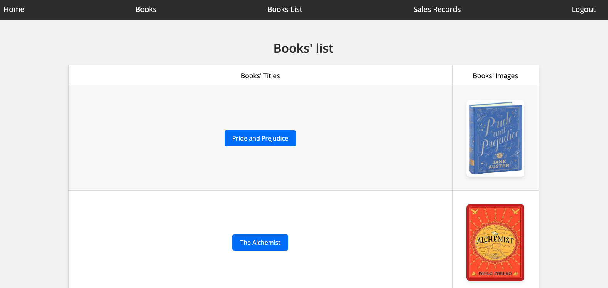

# Project Name

### Bookstore 

## Description

The Bookstore application provides comprehensive information on books, sales, and sales records. It includes admin capabilities to manage users, superusers, and books. The application is built with templates tailored for salespersons and customers, allowing for a seamless user experience.

## Features

- Admin capabilities to add and remove users and superusers
- Admin capabilities to add and remove books
- Detailed information on books
- Sales records management
- Templates for salespersons and customers
- User authentication and authorization
- Integration with PostgreSQL for data storage
- Deployment on Heroku

Link to Live Demo: https://sleepy-island-60497-040803a19474.herokuapp.com/

- **Frontend**: HTML, CSS, JavaScript
- **Backend**: Django
- **Database**: PostgreSQL
- **Deployment**: Heroku
- **Other**: Gunicorn, Whitenoise

## Screenshots

Here are some screenshots of the application:

## Books List


## Installation

### Prerequisites

- Python 3.x
- Django
- PostgreSQL
- Heroku CLI
  
See requirements file for more details

### Steps

1. Clone the repository:
   ```sh
   git clone https://github.com/timone019/Bookstore.git
   cd bookstore
   ```

2. Create a virtual environment & activate it:
   ```sh
   python -m venv venv
   source venv/bin/activate  
   # On Windows use `venv\Scripts\activate`
    ```

3. Install the required packages:
   ```sh
    pip install -r requirements.txt
    ```

4. Set up the database:
   ```sh
    python manage.py migrate
    ```

5. Create a superuser:
    ```sh
    python manage.py createsuperuser
    ```

6. Run the development server:
    ```sh
    python manage.py runserver
    ```

## Deployment
1. Log in to Heroku:
   ```sh
   heroku login
   ```

2. Create a new Heroku app:
   ```sh
   heroku create your-app-name
   ```

3. Set up the Heroku Postgres addon:
   ```sh
   heroku addons:create heroku-postgresql:essential-0
   ```

4. Push the code to Heroku:
   ```sh
   git push heroku main
   ```

5. Run migrations on Heroku:
   ```sh
   heroku run python manage.py migrate
   ```

6. Create a superuser on Heroku:
   ```sh
   heroku run python manage.py createsuperuser
   ```

## Usage
1. Navigate to the home page to browse the collection of books.
   
2. Log in to manage your own book collection.

3. Use the admin interface to add, edit, or delete books and manage users.

## Contributing
1. Fork the repository.

2. Create a new branch 
   ```sh 
   git checkout -b feature-branch
   ```

3. Make your changes and commit them 
   ```sh
   git commit -m 'Add new feature'

4. Push to the branch 
   ```sh
   git push origin feature-branch
   ```

5. Create a new Pull Request.